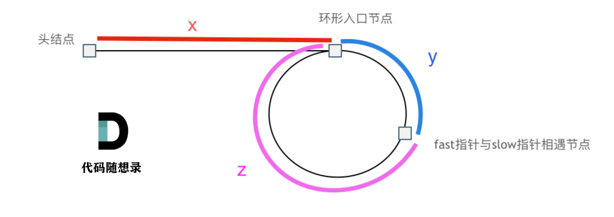

# 代码随想录算法训练营 Day 4
24. 两两交换链表中更多节点 | 203. 移除链表元素 | 面试题 02.07. 链表相交

---

## 24 - 两两交换链表中的节点
* 题目链接：[LeetCode 24 两两交换链表中的节点](https://leetcode.cn/problems/swap-nodes-in-pairs/)
* 文章链接：[代码随想录讲解 两两交换链表中的节点](https://programmercarl.com/0024.%E4%B8%A4%E4%B8%A4%E4%BA%A4%E6%8D%A2%E9%93%BE%E8%A1%A8%E4%B8%AD%E7%9A%84%E8%8A%82%E7%82%B9.html)

**看到题目的第一想法**  
感觉好像会写，但是写不对。

**看完代码随想录之后的想法**  
代码随想录的解法主要是提到，在增改删的时候要用虚拟头节点。

**实现过程中遇到的困难**  
这道题如过不用虚拟头节点的话，很容易乱。用了虚拟头节点，在逻辑中有时也写不清楚。画图，明白“拉直”这个描述后，就好写了。

---

### 代码
```cpp
class Solution {
public:
    ListNode* swapPairs(ListNode* head) {
        ListNode* dummy = new ListNode(0);
        dummy->next = head;
        ListNode* curr = dummy;
        while (curr->next != nullptr && curr->next->next != nullptr) {
            ListNode* tmp_1 = curr->next;
            ListNode* tmp_2 = curr->next->next->next;

            curr->next = curr->next->next;
            curr->next->next = tmp_1;
            curr->next->next->next = tmp_2;

            curr = curr->next->next;

        }
        return dummy->next;
    }
};
```

## 203 - 移除链表元素
* 题目链接：[LeetCode 203 移除链表元素](https://leetcode.cn/problems/remove-nth-node-from-end-of-list/)
* 文章链接：[代码随想录讲解 移除链表元素](https://programmercarl.com/0019.%E5%88%A0%E9%99%A4%E9%93%BE%E8%A1%A8%E7%9A%84%E5%80%92%E6%95%B0%E7%AC%ACN%E4%B8%AA%E8%8A%82%E7%82%B9.html)

**看到题目的第一想法**  
不太会，但知道要用虚拟头节点了。

**看完代码随想录之后的想法**  
原来要用双指针，和做数组的思路差不多。  

**实现过程中遇到的困难**  
要删除任意第 `n` 个节点时，需要指向第 `n-1` 的节点。 
关于找倒数第 `n` 个节点的话，要使用快慢两个指针。快指针指到 `n+1` 时开始动慢指针。如果快指针只走了 `n` 步，慢指针再动的话，等快指针到 `nullptr` 时，慢指针会正好指到 `n`，而不是前一个。所以要让快指针再快一步。

---

### 代码
```cpp
class Solution {
public:
    ListNode* removeNthFromEnd(ListNode* head, int n) {
        ListNode* dummy = new ListNode(0);
        dummy->next = head;
        int i = 0;
        ListNode* fast = dummy;
        ListNode* slow = dummy;

        while(fast != nullptr) {
            if (i > n) {
                slow = slow->next;
            }
            fast = fast->next;
            i++;
        }

        ListNode* tmp = slow->next;
        slow->next = slow->next->next;
        delete tmp;

        return dummy->next;
    }
};
```


## 面试题 02.07. 链表相交
* 题目链接：[LeetCode 面试题 02.07. 链表相交](https://leetcode.cn/problems/intersection-of-two-linked-lists-lcci/)
* 文章链接：[代码随想录讲解 链表相交](https://programmercarl.com/%E9%9D%A2%E8%AF%95%E9%A2%9802.07.%E9%93%BE%E8%A1%A8%E7%9B%B8%E4%BA%A4.html)

**看到题目的第一想法**  
做过，但是懵了。

**看完代码随想录之后的想法**  
知道找两个链表的长度差后，就觉得还挺简单的，做一遍就对了。

**实现过程中遇到的困难**  
还好，这题简单

---

### 代码
```cpp
class Solution {
public:
    ListNode *getIntersectionNode(ListNode *headA, ListNode *headB) {
        int size_a = 0;
        int size_b = 0;

        ListNode* curr_a = headA;
        ListNode* curr_b = headB;

        while (curr_a != nullptr) {
            curr_a = curr_a->next;
            size_a++;
        }

        while (curr_b != nullptr) {
            curr_b = curr_b->next;
            size_b++;
        }

        if (size_a > size_b) {
            for (int i = 0; i < size_a - size_b; i++) {
                headA = headA->next;
            }
        } else {
            for (int i = 0; i < size_b - size_a; i++) {
                headB = headB->next;
            }
        }

        while (headA != nullptr) {
            if (headA == headB) {
                return headA;
            }
            headA = headA->next;
            headB = headB->next;
        }

        return nullptr;
    }
};
```

## 142 - 环形链表 II
* 题目链接：[LeetCode 142 环形链表 II](https://leetcode.cn/problems/linked-list-cycle-ii/)
* 文章链接：[代码随想录讲解 环形链表 II](https://programmercarl.com/0142.%E7%8E%AF%E5%BD%A2%E9%93%BE%E8%A1%A8II.html)

**看到题目的第一想法**  
懵逼。

**看完代码随想录之后的想法**  
这题感觉挺难理解的，但是一旦理解，挺好做的。  
这道题的难点分为两部分，一是判断是不是环形链表，二是判断环形链表开始的位置。
判断环形链表的方式是用快慢指针，慢指针每次只走一步，快指针每次走两步。这样一次次迭代，如果是环形链表的话，快指针肯定会在一圈一圈后追到慢指针。
之后就是判断环形链表开始的位置。我们知道快指针一步走两个节点，慢指针一步走一个节点。所以当他们相遇时，快指针的节点数 `=` 慢指针的节点数。
  
以此图为例。我们得到 `(x + y) * 2 = x + y + n * (y + z)` 。这里 `n` 代表快指针在遇到慢指针之前走了多少圈。   
我们想知道从头节点走多少步到环形链表入口节点，所以得出 `x = (n - 1) * (y + z) + z`。我也不知道为啥非得要设只走了一圈，即`n = 1` 就才能得出 `x = z`。反正因为 `x = z`，我们只需要继续让快慢指针只走一步，头节点也一起走，在相遇的时候，就是环形入口节点了。

**实现过程中遇到的困难**  
实现过程比较顺利。

---

### 代码
```cpp
class Solution {
public:
    ListNode *detectCycle(ListNode *head) {
        ListNode* slow = head;
        ListNode* fast = head;
        while(fast != nullptr && fast->next != nullptr) {

            fast = fast->next->next;
            slow = slow->next;

            if (fast == slow) {
                while (head != fast) {
                    fast = fast->next;
                    head = head->next;
                }
                return head;
            }
        }
        return nullptr;
    }
};
```